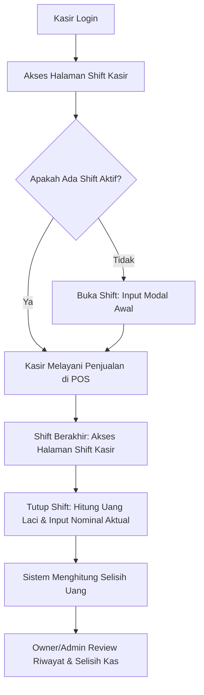

# Sistem Shift Kasir & Rekonsiliasi Kas - KasirPOS App

## Deskripsi
Sistem Shift Kasir dan Rekonsiliasi Kas Kecil (Cashier Shift & Cash Reconciliation System) dirancang untuk mendata, memantau, dan mencocokkan uang tunai (cash) yang ada di laci kasir sepanjang shift kerja. Sistem ini membantu pemilik toko (Owner/Admin) meminimalisir risiko selisih kas (discrepancy) antara pencatatan sistem dan uang fisik secara real-time.

---

## Fitur Utama

### 1. **Buka Shift Baru (Open Shift)**
* Kasir memasukkan nominal **Modal Awal** (uang pecahan untuk kembalian) saat membuka laci kasir di awal kerja.
* Sistem mencatat waktu buka (`opened_at`), kasir bertugas (`user_id`), dan status shift menjadi `open` (aktif).
* Catatan pembukaan opsional (`notes_open`) dapat ditambahkan (misal: "Menggunakan pecahan Rp 10rb dan Rp 5rb").

### 2. **Tutup Shift Aktif (Close Shift)**
* Kasir menghitung uang tunai fisik yang ada di laci kasir di akhir kerja secara manual.
* Kasir memasukkan nominal **Uang Aktual di Laci** (`closing_cash`).
* Sistem akan mengunci shift dengan status `closed` dan mencatat waktu tutup (`closed_at`).
* Catatan penutupan opsional (`notes_close`) dapat ditambahkan (misal: "Uang lecek Rp 50.000 tidak dihitung").

### 3. **Kalkulasi Otomatis Real-time**
Saat penutupan, sistem secara otomatis menghitung nilai-nilai berikut berdasarkan pesanan yang diselesaikan (`completed`) oleh kasir bersangkutan selama shift aktif:
* **Total Transaksi**: Jumlah order yang diproses oleh kasir selama shift berlangsung.
* **Total Omset**: Total nominal penjualan dari seluruh metode pembayaran (Cash, QRIS, Transfer, dll).
* **Penjualan Tunai (Cash Sales)**: Penjualan yang menggunakan metode pembayaran utama `cash`, ditambah porsi tunai dari metode pembayaran gabungan (split payment).
* **Uang Kembalian (Cash Change)**: Total uang kembalian yang telah diberikan kepada pelanggan dari pembayaran tunai.
* **Ekspektasi Uang Kas Akhir**: Formula perhitungan:
  $$\text{Expected Cash} = \text{Modal Awal} + \text{Penjualan Tunai} - \text{Uang Kembalian}$$
* **Selisih Kas (Discrepancy)**: Selisih antara uang aktual fisik yang diinput kasir dengan ekspektasi uang kas akhir:
  $$\text{Selisih (Discrepancy)} = \text{Uang Aktual di Laci (Closing Cash)} - \text{Ekspektasi Uang Kas Akhir}$$
  * Jika selisih $= 0$: Status **Cocok** (hijau).
  * Jika selisih $< 0$: Status **Kurang / Minus** (merah).
  * Jika selisih $> 0$: Status **Lebih** (kuning/emas).

### 4. **Banner Informasi Shift Aktif**
* Di setiap halaman aplikasi POS (Dashboard, Transaksi, dll), sistem mendeteksi jika kasir yang login sedang berada dalam shift aktif.
* Muncul banner melayang (*floating alert*) di bagian atas yang mengingatkan status shift aktif, lengkap dengan tombol shortcut untuk langsung menuju ke halaman Shift Kasir guna melakukan penutupan.

### 5. **Riwayat Shift & Filter**
* Admin, Owner, dan Kasir dapat melihat daftar riwayat shift yang telah ditutup sebelumnya.
* Filter pencarian tersedia berdasarkan:
  * Rentang Tanggal (Mulai - Selesai)
  * Status Shift (`Aktif / Terbuka` atau `Sudah Ditutup`)

---

## Alur Kerja Penggunaan



### 1. Awal Kerja (Buka Shift)
1. Kasir masuk ke menu **Shift Kasir** di sidebar (ikon Jam/Clock).
2. Jika belum ada shift aktif, kasir akan melihat formulir **Buka Shift Baru**.
3. Masukkan nominal uang yang ada di laci (contoh: `200000` untuk Rp 200.000).
4. Klik **Buka Shift Baru**.
5. Banner status shift aktif sekarang muncul di atas layar.

### 2. Selama Bekerja (Transaksi)
1. Kasir melayani pemesanan pelanggan di halaman POS seperti biasa.
2. Setiap pembayaran tunai, non-tunai, atau kembalian akan otomatis dilacak oleh sistem dan diasosiasikan dengan shift kasir tersebut secara real-time.

### 3. Akhir Kerja (Tutup Shift & Serah Terima)
1. Kasir kembali ke menu **Shift Kasir**.
2. Kasir melihat ringkasan penjualan sementara (Total Transaksi, Omset, Penjualan Tunai, Kembalian, dan Estimasi Uang Kas).
3. Kasir menghitung uang tunai fisik di laci secara manual.
4. Klik tombol **Tutup Shift Kasir**.
5. Masukkan nominal fisik yang telah dihitung (misal: `1450000` untuk Rp 1.450.000) dan catatan penutupan jika ada.
6. Klik tombol **Konfirmasi Tutup Shift**.
7. Sistem mengunci data dan menampilkan detail rekonsiliasi akhir.

---

## Struktur Database

### Tabel: `cashier_shifts`

| Nama Kolom | Tipe Data | Keterangan |
| :--- | :--- | :--- |
| `id` | bigint (unsigned) | Primary Key |
| `user_id` | bigint (unsigned) | ID Kasir yang bertugas (Foreign Key -> `users`) |
| `store_id` | bigint (unsigned) | ID Outlet/Toko tempat bertugas (Foreign Key -> `stores`) |
| `opened_at` | timestamp | Waktu pembukaan shift |
| `closed_at` | timestamp (nullable) | Waktu penutupan shift |
| `opening_cash` | decimal(15,2) | Nominal modal awal |
| `closing_cash` | decimal(15,2) (nullable) | Nominal uang kas aktual akhir yang dihitung fisik |
| `expected_cash` | decimal(15,2) (nullable) | Ekspektasi uang kas akhir berdasarkan perhitungan sistem |
| `cash_sales` | decimal(15,2) (nullable) | Total penjualan tunai (termasuk porsi cash di split-payment) |
| `cash_change` | decimal(15,2) (nullable) | Total kembalian tunai yang diberikan |
| `discrepancy` | decimal(15,2) (nullable) | Nilai selisih kas (`closing_cash - expected_cash`) |
| `total_transactions`| unsigned integer (nullable)| Jumlah transaksi sukses yang ditangani |
| `total_revenue` | decimal(15,2) (nullable) | Total omset (semua metode pembayaran) |
| `notes_open` | text (nullable) | Catatan saat buka shift |
| `notes_close` | text (nullable) | Catatan saat tutup shift |
| `status` | enum('open', 'closed') | Status shift (`open` atau `closed`) |
| `created_at` / `updated_at` | timestamp | Waktu data dibuat & diperbarui |

---

## API Endpoints (Laravel Backend)

Seluruh endpoint berada di bawah prefix `/api` dan membutuhkan token autentikasi (Bearer Token).

| Method | Endpoint | Deskripsi | Parameter Body / Query |
| :--- | :--- | :--- | :--- |
| **GET** | `/api/cashier-shifts` | Riwayat shift kasir | *Query*: `start_date`, `end_date`, `status` |
| **GET** | `/api/cashier-shifts/active` | Mendapatkan shift aktif saat ini | - |
| **POST** | `/api/cashier-shifts/open` | Membuka shift baru | *Body*: `opening_cash` (numeric), `notes_open` (string, optional) |
| **POST** | `/api/cashier-shifts/close` | Menutup shift aktif | *Body*: `closing_cash` (numeric), `notes_close` (string, optional) |
| **GET** | `/api/cashier-shifts/{id}` | Detail shift berdasarkan ID | - |
| **GET** | `/api/cashier-shifts/{id}/summary` | Summary kalkulasi penjualan real-time | - |

---

## Panduan Deployment di VPS (Langkah demi Langkah)

Untuk menerapkan pembaruan sistem shift kasir ini pada server VPS Anda, ikuti langkah-langkah di bawah ini:

### Langkah 1: Hubungkan ke VPS
Masuk ke VPS Anda via SSH (misal menggunakan PuTTY atau Terminal):
```bash
ssh username@ip-address-vps
```
Arahkan ke direktori tempat proyek disimpan di VPS Anda:
```bash
cd /path/to/your/app/POS-APP
```

### Langkah 2: Ambil Update Terbaru dari Git
Tarik kode terbaru yang baru saja di-push dari repository Git utama:
```bash
git pull origin master
```

### Langkah 3: Jalankan Migrasi Database (Backend)
Masuk ke direktori `backend-App` dan jalankan perintah migrasi Laravel untuk membuat tabel baru `cashier_shifts`:
```bash
cd backend-App

# Jalankan migrasi database
php artisan migrate --force
```
*(Catatan: Flag `--force` digunakan agar migrasi berjalan di production environment tanpa konfirmasi interaktif).*

### Langkah 4: Build Ulang Frontend (React/TypeScript)
Masuk ke direktori `frontend-app`, lakukan instalasi library baru (jika ada) dan build ulang aset produksi:
```bash
cd ../frontend-app

# Install dependencies (jika ada update di package.json)
npm install

# Build aplikasi React ke folder 'dist'
npm run build
```

### Langkah 5: Reload / Restart Layanan (Opsional)
Tergantung arsitektur VPS Anda (misalnya menggunakan Nginx dan PM2, php-fpm, atau docker), lakukan reload agar perubahan terbaca secara optimal:
* **Jika menggunakan Nginx**: Biasanya tidak perlu restart jika hanya merubah folder `dist` frontend, namun pastikan permission folder aman.
* **Jika menggunakan queue worker / cache**:
  ```bash
  cd ../backend-App
  php artisan config:cache
  php artisan route:cache
  php artisan view:clear
  ```

---

## Hak Akses (Permissions)

* Halaman **Shift Kasir** diintegrasikan ke sistem hak akses yang ada dengan menggunakan permission: `manage_orders`.
* Semua User dengan posisi/peran yang memiliki hak akses transaksi pemesanan (seperti Kasir, Karyawan Toko, Owner, dan Admin) dapat mengelola shift mereka masing-masing.
* Hak akses ini diatur di tabel `role_permissions` dan divalidasi pada routing API backend.

---

## File yang Dibuat / Dimodifikasi

Berikut adalah ringkasan berkas yang terlibat dalam fitur ini:

### Backend (Laravel 12):
1. **[NEW]** `backend-App/database/migrations/2026_06_25_000000_create_cashier_shifts_table.php` (Tabel database shift)
2. **[NEW]** `backend-App/app/Models/CashierShift.php` (Model dengan global scope `BelongsToStore` dan logika kalkulasi order)
3. **[NEW]** `backend-App/app/Http/Controllers/CashierShiftController.php` (Controller API handling Buka/Tutup/Summary/History)
4. **[MODIFY]** `backend-App/routes/api.php` (Penambahan rute-rute API shift)

### Frontend (React + TypeScript):
1. **[NEW]** `frontend-app/src/pages/CashierShiftPage.tsx` (Halaman UI kelola shift, modal buka/tutup, ringkasan real-time, dan riwayat shift)
2. **[MODIFY]** `frontend-app/src/App.tsx` (Definisi router path `/cashier-shifts` menuju halaman baru)
3. **[MODIFY]** `frontend-app/src/components/layout/Sidebar.tsx` (Penambahan menu navigasi "Shift Kasir" di sidebar dengan icon `Clock`)

---

## Panduan Pemecahan Masalah (Troubleshooting) VPS

### 1. Error: `Table 'cashier_shifts' doesn't exist`
* **Penyebab**: Migrasi belum dijalankan di database VPS.
* **Solusi**: Masuk ke folder `backend-App` di VPS, periksa koneksi `.env`, lalu jalankan `php artisan migrate --force`.

### 2. Tombol "Shift Kasir" Tidak Muncul di Sidebar
* **Penyebab**: Role user yang digunakan login tidak memiliki permission `manage_orders`, atau frontend belum sukses di-build.
* **Solusi**: 
  1. Pastikan database `role_permissions` memberikan akses `manage_orders` ke role Anda.
  2. Jalankan `npm run build` kembali di folder `frontend-app` VPS dan pastikan folder `dist` terbaca oleh Nginx.

### 3. Selisih Uang Selalu Negatif / Tidak Cocok
* **Penyebab**: Kasir salah menghitung uang laci, atau ada pesanan yang diinput setelah shift ditutup, atau kasir lain memakai akun yang sama.
* **Solusi**: Lakukan rekonsiliasi harian dengan membandingkan detail transaksi di riwayat pesanan dengan log shift kasir di halaman detail shift. Pastikan setiap kasir memiliki akun masing-masing untuk menjaga akurasi data.
