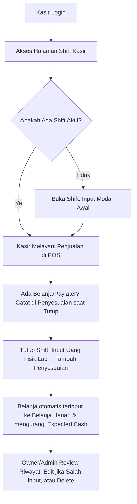

# Sistem Shift Kasir & Rekonsiliasi Kas - KasirPOS App

## Deskripsi
Sistem Shift Kasir dan Rekonsiliasi Kas Kecil (Cashier Shift & Cash Reconciliation System) dirancang untuk mendata, memantau, dan mencocokkan uang tunai (cash) yang ada di laci kasir sepanjang shift kerja. Sistem ini membantu pemilik toko (Owner/Admin) meminimalisir risiko selisih kas (discrepancy) antara pencatatan sistem dan uang fisik secara real-time, serta mencatat pengeluaran operasional (belanja harian) dan transaksi piutang (paylater) secara terintegrasi.

---

## Fitur Utama

### 1. **Buka Shift Baru (Open Shift)**
* Kasir memasukkan nominal **Modal Awal** (uang pecahan untuk kembalian) saat membuka laci kasir di awal kerja.
* Catatan pembukaan opsional (`notes_open`) dapat ditambahkan.

### 2. **Tutup Shift Aktif (Close Shift) & Keterangan Selisih**
* Kasir menghitung uang tunai fisik yang ada di laci kasir secara manual dan menginput nominal aktualnya (`closing_cash`).
* **Penyesuaian / Keterangan Selisih (Adjustments)**: Kasir dapat menambahkan daftar keterangan (misal: paylater, belanja harian) lengkap dengan nominalnya untuk memberikan penjelasan mengapa kas menjadi minus/lebih.
  * Uang cash di laci tetap menjadi acuan utama kalkulasi selisih agar tidak terjadi kesalahan hitung kas fisik.
  * Catatan penutupan opsional (`notes_close`) dapat ditambahkan.

### 3. **Integrasi Otomatis Belanja Harian**
* Jika kasir menginput keterangan penyesuaian berjenis **Belanja** (mencentang pilihan "Belanja" saat input penyesuaian), sistem akan:
  1. **Secara otomatis memasukkan data belanja tersebut ke modul Belanja Harian** (`daily_shopping`).
  2. **Mengurangi nominal Ekspektasi Uang Kas** di laci secara real-time karena kas keluar diambil dari laci cash kasir.

### 4. **Pelacakan QRIS/TF, Kartu, & Paylater**
Sistem melacak dan mengelompokkan penjualan berdasarkan seluruh metode pembayaran untuk pencocokan yang akurat:
* **Penjualan Tunai (Cash Sales)**: Total penjualan tunai (termasuk porsi tunai dari split-payment).
* **Penjualan QRIS / Transfer**: Total penjualan QRIS/Transfer (termasuk porsi QRIS dari split-payment).
* **Penjualan Kartu**: Total penjualan menggunakan kartu debit/kredit.
* **Paylater / Pending**: Total penjualan dengan metode "Bayar Nanti" (pembayaran pending).

### 5. **Kalkulasi Selisih Kas (Discrepancy) Real-time**
Formula kalkulasi Ekspektasi Uang Kas Akhir di Laci:
$$\text{Expected Cash} = \text{Modal Awal} + \text{Penjualan Tunai} - \text{Uang Kembalian} - \text{Belanja (Pengeluaran Tunai)}$$

Formula Selisih Kas:
$$\text{Selisih} = \text{Uang Aktual di Laci (Closing Cash)} - \text{Ekspektasi Uang Kas Akhir}$$

### 6. **Fitur Edit & Delete (Khusus Admin / Owner)**
* **Edit**: Admin/Owner dapat menyunting detail shift (seperti mengubah status shift, mengedit nominal modal awal, nominal uang aktual, catatan, serta daftar penyesuaian adjustments).
* **Delete**: Admin/Owner dapat menghapus rekaman shift kasir. Jika shift dihapus, data belanja harian yang terinput otomatis dari shift tersebut juga akan ikut dibersihkan agar database tetap sinkron.

---

## Alur Kerja Penggunaan



---

## Struktur Database

### 1. Tabel: `cashier_shifts`

| Nama Kolom | Tipe Data | Keterangan |
| :--- | :--- | :--- |
| `id` | bigint (unsigned) | Primary Key |
| `user_id` | bigint (unsigned) | ID Kasir yang bertugas (Foreign Key -> `users`) |
| `store_id` | bigint (unsigned) | ID Outlet/Toko tempat bertugas (Foreign Key -> `stores`) |
| `opened_at` | timestamp | Waktu pembukaan shift |
| `closed_at` | timestamp (nullable) | Waktu penutupan shift |
| `opening_cash` | decimal(15,2) | Nominal modal awal |
| `closing_cash` | decimal(15,2) (nullable) | Nominal uang kas aktual akhir yang dihitung fisik |
| `expected_cash` | decimal(15,2) (nullable) | Ekspektasi uang kas akhir berdasarkan perhitungan sistem |
| `cash_sales` | decimal(15,2) (nullable) | Total penjualan tunai |
| `cash_change` | decimal(15,2) (nullable) | Total kembalian tunai yang diberikan |
| `qris_sales` | decimal(15,2) | Total penjualan QRIS / Bank Transfer |
| `card_sales` | decimal(15,2) | Total penjualan Kartu Debit/Kredit |
| `discrepancy` | decimal(15,2) (nullable) | Nilai selisih kas (`closing_cash - expected_cash`) |
| `total_transactions`| unsigned integer (nullable)| Jumlah transaksi sukses yang ditangani |
| `total_revenue` | decimal(15,2) (nullable) | Total omset (semua metode pembayaran) |
| `notes_open` | text (nullable) | Catatan saat buka shift |
| `notes_close` | text (nullable) | Catatan saat tutup shift |
| `adjustments` | json (nullable) | Daftar penyesuaian: `[{"amount":50000,"notes":"Paylater Customer X","is_shopping":false}]` |
| `status` | enum('open', 'closed') | Status shift (`open` atau `closed`) |
| `created_at` / `updated_at` | timestamp | Waktu data dibuat & diperbarui |

### 2. Tabel: `daily_shopping` (Modifikasi)
* Menambahkan kolom `cashier_shift_id` (bigint, unsigned, nullable) dengan relasi `constrained` ke `cashier_shifts` dan `nullOnDelete` untuk menghubungkan pengeluaran belanja langsung ke shift bersangkutan.

---

## API Endpoints (Laravel Backend)

Seluruh endpoint berada di bawah prefix `/api` dan membutuhkan token autentikasi (Bearer Token).

| Method | Endpoint | Deskripsi | Parameter Body / Query |
| :--- | :--- | :--- | :--- |
| **GET** | `/api/cashier-shifts` | Riwayat shift kasir | *Query*: `start_date`, `end_date`, `status` |
| **GET** | `/api/cashier-shifts/active` | Mendapatkan shift aktif saat ini | - |
| **POST** | `/api/cashier-shifts/open` | Membuka shift baru | *Body*: `opening_cash` (numeric), `notes_open` (string, optional) |
| **PUT** | `/api/cashier-shifts/{id}/close` | Menutup shift aktif | *Body*: `closing_cash` (numeric), `notes_close` (string), `adjustments` (array, optional) |
| **GET** | `/api/cashier-shifts/{id}` | Detail shift berdasarkan ID | - |
| **PUT** | `/api/cashier-shifts/{id}` | Memperbarui detail shift (Edit) | *Body*: `opening_cash`, `closing_cash`, `notes_open`, `notes_close`, `status`, `adjustments` |
| **DELETE** | `/api/cashier-shifts/{id}` | Menghapus data shift (Delete) | - |
| **GET** | `/api/cashier-shifts/summary` | Summary statistik laporan | *Query*: `start_date`, `end_date` |

---

## Panduan Deployment di VPS (Langkah demi Langkah)

Untuk menerapkan pembaruan sistem shift kasir baru ini pada server VPS Anda, ikuti langkah-langkah di bawah ini:

### Langkah 1: Hubungkan ke VPS
Masuk ke VPS Anda via SSH:
```bash
ssh username@ip-address-vps
cd /path/to/your/app/POS-APP
```

### Langkah 2: Ambil Update Terbaru dari Git
Tarik kode terbaru:
```bash
git pull origin master
```

### Langkah 3: Jalankan Migrasi Database
Jalankan perintah migrasi Laravel untuk menambahkan kolom-kolom baru:
```bash
cd backend-App
php artisan migrate --force
```

### Langkah 4: Build Ulang Frontend
```bash
cd ../frontend-app
npm install
npm run build
```

### Langkah 5: Hapus Cache Laravel
```bash
cd ../backend-App
php artisan cache:clear
php artisan route:cache
php artisan config:cache
```

---

## Berkas yang Terlibat

### Backend (Laravel 12):
1. **[NEW]** `backend-App/database/migrations/2026_06_25_000000_create_cashier_shifts_table.php` (Tabel database shift)
2. **[NEW]** `backend-App/database/migrations/2026_06_25_000001_add_features_to_cashier_shifts_and_daily_shopping.php` (Kolom QRIS, Card, Adjustments, dan Relasi Belanja)
3. **[MODIFY]** `backend-App/app/Models/CashierShift.php` (Model casts, relations, dan update formula expected cash)
4. **[MODIFY]** `backend-App/app/Models/DailyShopping.php` (Menambahkan fillable & relasi ke shift)
5. **[MODIFY]** `backend-App/app/Http/Controllers/CashierShiftController.php` (Menambah fungsi update, destroy, dan sync daily_shopping)
6. **[MODIFY]** `backend-App/routes/api.php` (Rute rute API edit & delete)

### Frontend (React + TypeScript):
1. **[MODIFY]** `frontend-app/src/pages/CashierShiftPage.tsx` (Penambahan UI input penyesuaian belanja/paylater, modal Edit, aksi Hapus, dan detail QRIS/TF, Kartu, Belanja, Paylater)
